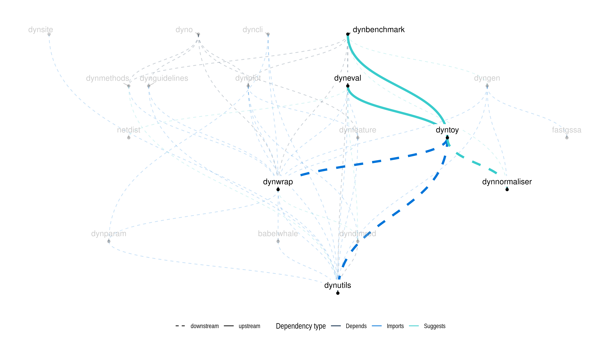

<!-- README.md is generated from README.Rmd. Please edit that file -->

# dyntoy

dyntoy simulates single-cell expression data in which a single-cell
trajectory is present. Even though the model to generate the data is
very simplistic (and far from realistic), it can simulate very complex
trajectory models, such as large trees, convergences and loops.

As the data is relatively easy, it can be used to quickly test and
prototype a [TI method](https://github.com/dynverse/dynmethods).
However, for more realistic synthetic data, check out our [dyngen
package](https://github.com/dynverse/dyngen).

## Installation

Install using devtools:

``` r
# install.packages("devtools")
devtools::install_github("dynverse/dyntoy")
```

## Example

dyntoy contains some pre-generated toy data within the `toy_datasets`
data object:

``` r
data("toy_datasets", package = "dyntoy")
```

Data can be generated using `generate_dataset`:

``` r
library(dyntoy)
dataset <- generate_dataset(
  model = model_bifurcating(),
  num_cells = 1000,
  num_features = 1000
)

dataset$milestone_network
#> # A tibble: 3 x 4
#>   from  to    length directed
#>   <chr> <chr>  <dbl> <lgl>   
#> 1 M3    M4    0.191  TRUE    
#> 2 M1    M3    0.417  TRUE    
#> 3 M3    M2    0.0432 TRUE
```

## Related work

  - PROSSTT: <https://github.com/soedinglab/prosstt>
  - Splatter: <https://github.com/Oshlack/splatter>

## Latest changes

Check out `news(package = "dynwrap")` or [NEWS.md](inst/NEWS.md) for a
full list of
changes.

<!-- This section gets automatically generated from inst/NEWS.md, and also generates inst/NEWS -->

### Recent changes in dyntoy 1.0.0 (unreleased)

  - Initial release of dyntoy

  - Generates simple toy datasets containg trajectories, with
    expression, RNA velocity, differentially expressed
features

## Dynverse dependencies

<!-- Generated by "update_dependency_graphs.R" in the main dynverse repo -->


